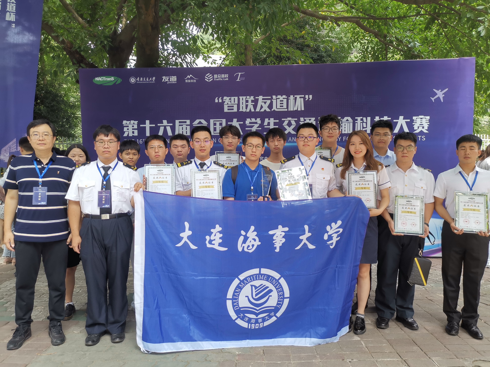
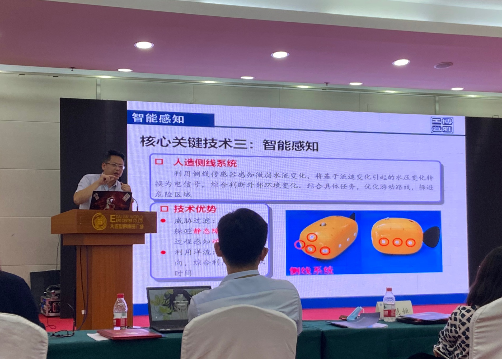
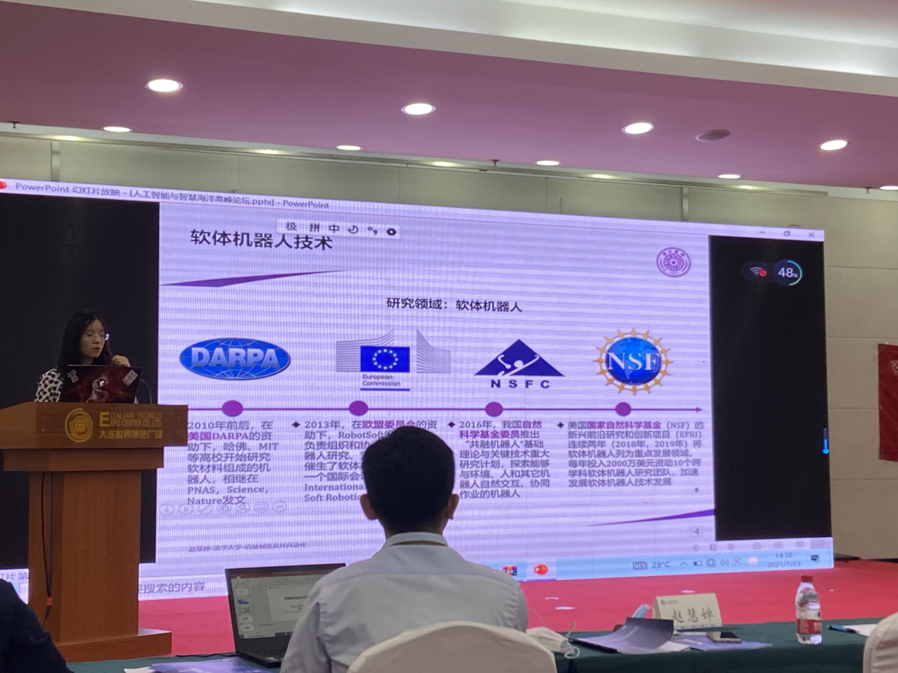
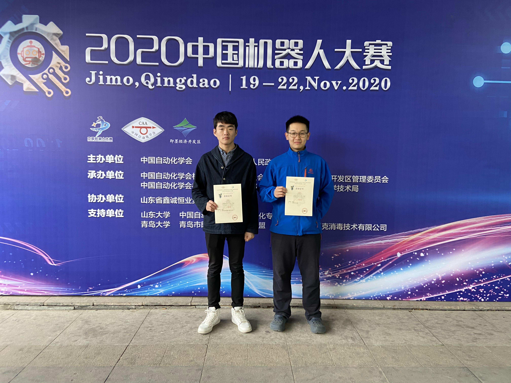
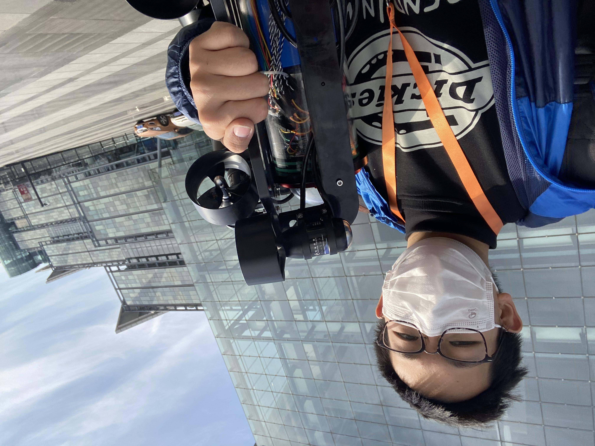
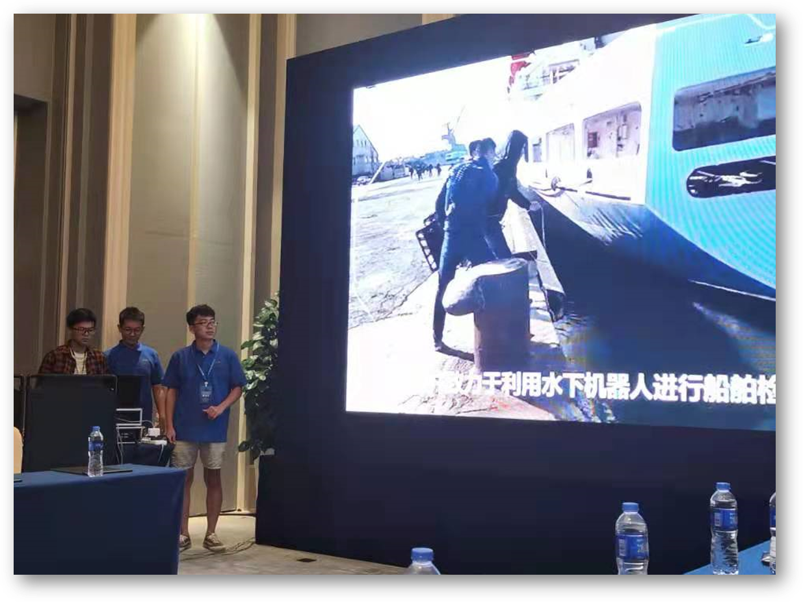
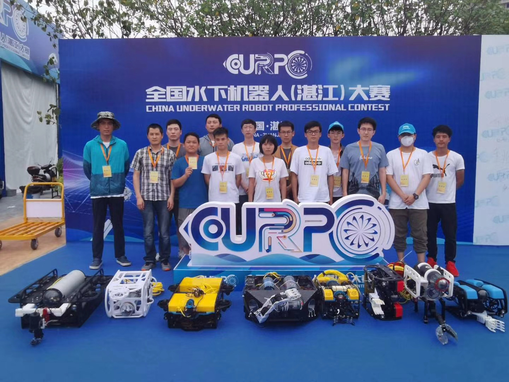
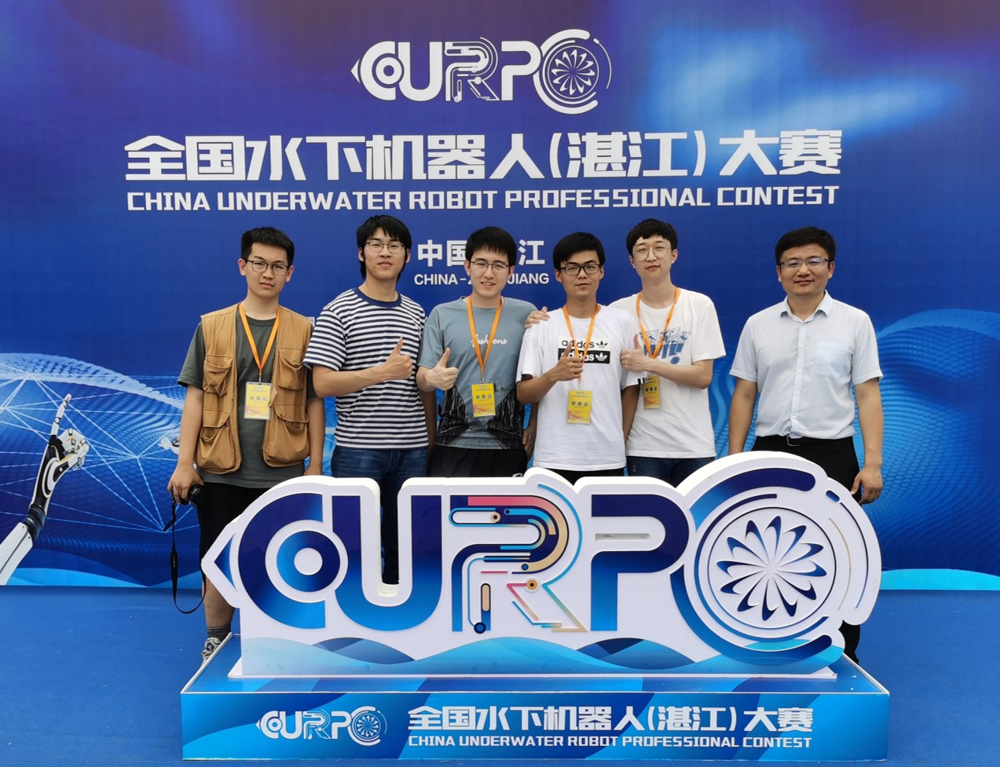

Annual meeting:point_up_2:

First prize of transportation technology competition(2021.8):point_down:

CDS(2021.7):point_down:

Zhonglin Wang Academician came to the laboratory to exchange ideas(2021.6):point_down:

Second prize of China robot competition(2020.12):point_down:

Underwater intelligent equipment innovation design competition(2020.11):point_down:

Underwater robot target capture competition(Dalian-2021.8):point_down:

Underwater robot target capture competition(Zhanjiang-2021.5):point_down:

